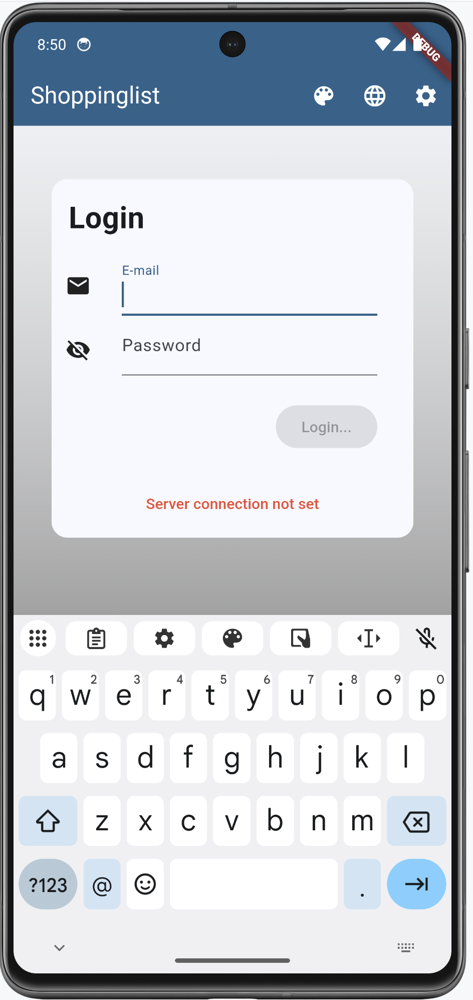
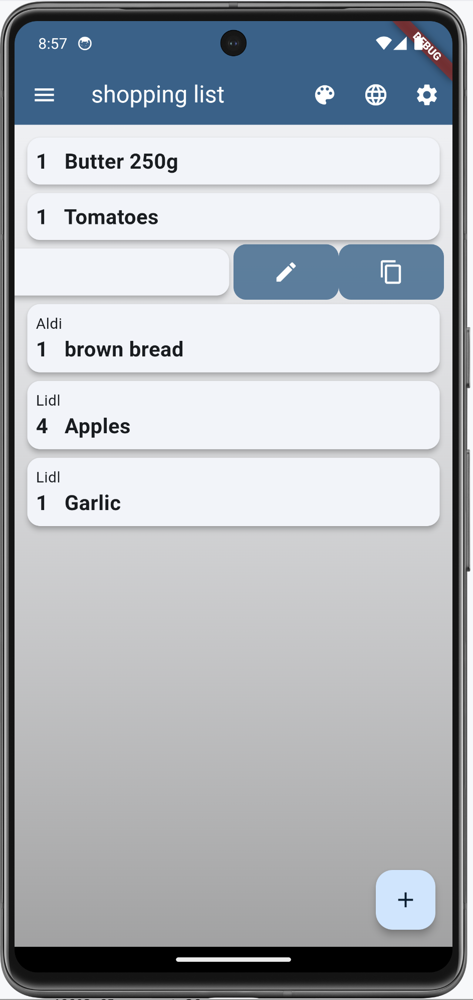

# Shoppinglist with Flutter and PocketBase

## Overview

The purpose of this app is to maintain a shoppinglist that can be used by more than one person.
In our family, we all use this app to inform the others about the goods that are wanted. If someone goes shopping,
he/she can buy the goods for all family members.

The backend software PocketBase informs all running instances of the app about changes in the
list. So, if you're inside a shop, you will see also articles that are newly put in the list by other members.

This app needs a PocketBase backend, running somewhere. PocketBase is a Firebase clone in one single binary.
More infos on [the PocketBase homepage](https://pocketbase.io). On that page is a good description to run PocketBase
on [fly.io](https://github.com/pocketbase/pocketbase/discussions/537) in the discussion area. There are some chapters
about fly.io further down below.

### Features

- Dart 3 and Flutter 3.13 compatible
- several themes with custom options including dark modes
- localization (English and German)
- works on Android, iOS, Linux, MacOS, Windows and Web

### Screenshots

    
    
    

    
    
    

    
    
    

    
    

Here are some tips for the shopping list:

- you can mark an article as _inCart_ by double clicking the article itself
- click on the plus or minus sign to change the quantity of that article
- when you swipe the article to the left, the article can be edited (pen symbol) and duplicated (copy symbol)
- a long press on the article will also open the edit dialog
- _inCart_ articles are placed at the end of the list to have a clearer view about what is left
- articles are grouped by shop and sorted alphabetically
- in the search dialog, a new article can be be added by pressing the plus sign

When the server can't be reached, an icon is displayed in the app bar.

    

## Technical description

There is only one database table 'shoppinglist' that is used in this app. This table (or collection)
has the following fields that must be created beforehand:

- `active` : Bool
- `amount` : Number, Min=0, Max=100
- `inCart` : Bool
- `article` : Plain text, Min length=1, Max length=120, Nonempty, Unique
- `shop` : Plain text, Max length=80

> **Info**
>
> There is also a schema file in JSON format (`pb_schema.json`) that can be imported in PocketBase to
> create this collection.

When an article is marked _`active`_, it will be visible on the **shopping list**. Otherwise the article will
show up in the **article list**.

## Get it working

### Install / deploy PocketBase

Proceed as follows:

1. deploy or install PocketBase (local is fine)
1. open the admin page of PocketBase (create PocketBase admin user on the fly)
1. import `pb_schema.json` to create the shoppinglist collection (via "Sync - Import Collection")
1. create users with email and password. Mark them as verified and give them a **NAME**. This name is visible in the app.
1. enter some data in the shoppinglist collection or do it later in the app

### Compile / run Shoppinglist

I assume, that Flutter is installed on your machine and that `flutter doctor` doesn't show errors for the platform
your gonna use.

1. run **`flutter run`** to start the application with a local installed PocketBase
1. if your PocketBase instance is not on localhost, you have to run
   **`flutter run --dart-define=SHOPPINGLIST_HOST=https://YOUR-POCKETBASE-DOMAIN.com`**
1. to create an Android app i.e. run **`flutter build apk --dart-define=SHOPPINGLIST_HOST=http://IP-ADDRESS-OF-POCKETBASE-SERVER:8090`**
Please use a *real* ip-address and **not** localhost!
1. inside the app, login with email and password

That's it. Have fun and go shopping!

> ## **Important**
>
> If you run PocketBase locally and want to access it i.e. from the Android Emulator, you need to start
> PocketBase like this:
>
> `> pocketbase serve --http 0.0.0.0:8090`
>
> This ensures, that PocketBase will listen on all addresses. Furthermore, you need to set the environment variable
> `SHOPPINGLIST_HOST` with the correct ip-address of your host machine like `http://192.168.0.52`. The address depends
> on your network and you should look it up with tools like `ip a`, `ipconfig` or `ifconfig`.

## Run a debug Web version with external host

If you want to run the app as a Web app together with an external host, you have to use a commandline like this:

    > flutter run -d chrome --dart-define=SHOPPINGLIST_HOST=https://YOUR-POCKETBASE-DOMAIN.com

## Create release builds

To create a release build that uses the right PocketBase url, you have to set a command line option to supply the environment variable to flutter:

    > flutter build apk --dart-define=SHOPPINGLIST_HOST=https://YOUR-POCKETBASE-DOMAIN.com

## Using Visual Studio Code

In order to have the right environment variable when running or debugging the app in VSCode, you
have to create a launch configuration `.vscode/launch.json` and have a configuration like this:

    {
        "version": "0.2.0",
        "configurations": [
            {
                "name": "shoppinglist",
                "request": "launch",
                "type": "dart",
                // Arguments to be passed to the Flutter app
                "args": [
                    "--dart-define",
                    "SHOPPINGLIST_HOST=https://YOUR-POCKETBASE-DOMAIN.com"
                ]
            },
        ]
    }

## Localization

The app uses the `Intl` package to maintain different localizations. Run the following command, if you change
the content of the `./lib/l10n/*.arb` files or if you are compiling the source for the first time:

    > flutter gen-l10n

This will update or create the files in `.dart_tool/flutter_gen/gen_l10n`.

## PocketBase running on fly.io

In the following chapters I show some useful commands to help you manage PocketBase on fly.io. I assume, that you're in the folder where the `Dockerfile` and the file `fly.toml` reside.

### Inspect container

If you want to see what is currently in the container:

    > flyctl ssh console
    # ls -l /pb/pb_data

### Backup

Make a local backup of the database file:

    > flyctl ssh sftp get /pb/pb_data/data.db ./data.db

### Restore

Restore a database backup on fly.io:

    > flyctl ssh sftp shell
    >> put ./LOCAL-PATH-WITH-DB/data.db /pb/pb_data/data.db

After that, you should restart PocketBase, in order to use the restored database:

    > flyctl apps restart YOUR_APPLICATION_NAME

### Deploy new PocketBase version

You have to update the `fly.toml` in respect of the PocketBase version (`PB_VERSION`). After doing that, run

    > flyctl deploy

Your database will not be affected and remains as it is.
