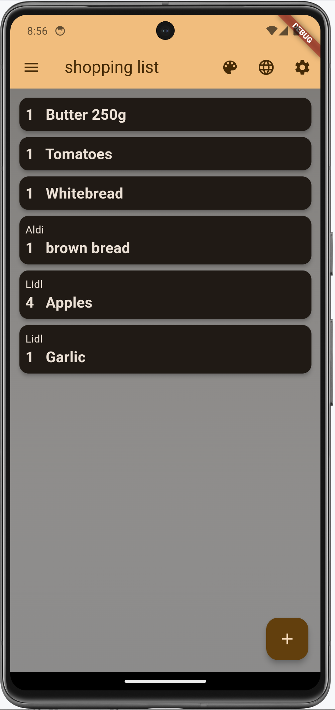
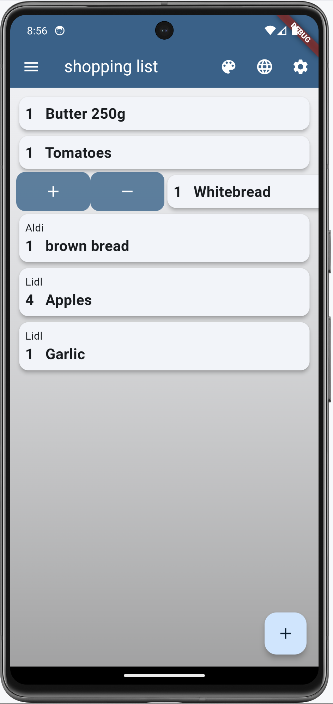
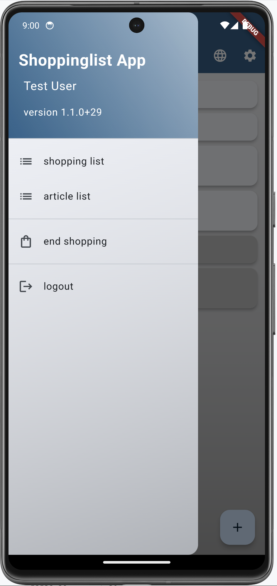

# Shopping list made with Flutter and PocketBase

## Overview

The purpose of this app is to maintain a shopping list that can be used by more than one person.
In our family, we all use this app to inform the others about the goods that are wanted. If someone goes shopping,
he/she can buy the goods for all family members.

The backend software PocketBase informs all running instances of the app about changes in the
list. So, if you're inside a shop, you will see also articles that are newly put in the list by other members.

This app needs a PocketBase backend, running somewhere. PocketBase is a Firebase clone in one single binary.
More infos on [the PocketBase homepage](https://pocketbase.io). On that page is a good description, how to run PocketBase
on [fly.io](https://github.com/pocketbase/pocketbase/discussions/537) (discussion area). There are some chapters about fly.io further down below.

### Features

- Dart 3 and Flutter 3.32 compatible
- Works with PocketBase v0.29
- several themes with custom options including dark modes
- localization (English and German)
- it works on Android, iOS, Linux, macOS, Windows and Web (also WebAssembly)

### Screenshots

    
    
    

    
    
    

    
    
    

    
    
    

    

### Here are some tips for the shopping list:

- you can mark an article as _inCart_ by double-clicking the article itself
- when you swipe the article to the right, a click on the plus or minus sign will change the quantity of that article
- when you swipe the article to the left, the article can be edited (pen symbol) and duplicated (copy symbol)
- a long press on the article will also open the edit dialog
- articles are grouped by shop and sorted alphabetically
- articles marked _inCart_ are placed at the end of the list to have a clearer view about what is left
- in the search dialog, a new article can be added by pressing the plus sign

When the server can't be reached, an icon is displayed in the app bar.

    

## Technical description

There is only one database table 'shoppinglist' that is used in this app. This table (or collection)
has the following fields that must be created beforehand:

- `active` : Bool
- `amount` : Number, Min=0, Max=100
- `inCart` : Bool
- `article` : Plain text, Min length=1, Max length=120, Nonempty, Unique
- `shop` : Plain text, Max length=80

> **Info**
>
> There is also a schema file in JSON format (`pb_schema.json`) that can be imported in PocketBase to
> create this collection.

When an article is marked _`active`_, it will be visible on the **shopping list**. Otherwise, the article will
show up in the **article list**.

## Get it working

### Install / deploy PocketBase

Proceed as follows:

1. deploy or install PocketBase (local is fine)
2. open the admin page of PocketBase (create PocketBase admin user on the fly)
3. import `pb_schema.json` to create the `shoppinglist` collection (via "Sync - Import Collection")
4. create users with email and password. Mark them as verified and give them a **NAME**. This name is visible in the app.
5. enter some data in the `shoppinglist` collection or do it later in the app

### Compile / run Shoppinglist

I assume that Flutter is installed on your machine and that `flutter doctor` doesn't show errors 
for the platform you're using.

1. run `flutter gen-l10n` to compile the localization files
2. run **`flutter run`** to start the application
3. click on the settings icon to open the PocketBase connection dialog and enter the url of the PocketBase server (typically http://localhost:8090) 
4. to create i.e., an Android app, run **`flutter build apk`**. Please use a *real* ip-address and **not** localhost! (see also note below)
5. inside the app, login with the email and password of a user that you created on the PocketBase admin page

That's it. Have fun and go shopping!

> **Important**
>
> If you run PocketBase locally and want to access it, i.e. from the Android Emulator, you need to start
> PocketBase like this:
>
> `> pocketbase serve --http 0.0.0.0:8090`
>
> This ensures that PocketBase will listen on all addresses. Furthermore, you need to set the 
> connection url with the correct ip-address of your host machine like `http://192.168.0.52:8090`. 
> The address depends on your network, and you should look it up with tools like `ip a`, 
> `ipconfig` or `ifconfig`.

### Command line parameter
There is one parameter that can be set via

    --dart-define="SHOPPINGLIST_HOST=http://localhost:8090"

When this parameter is set, it overrides the URL that is set via the UI. This makes it easy
to switch between different PocketBase instances while developing.

## Run a debug Web version with an external host

If you want to run the app as a Web app, you have to use a commandline like this:

    > flutter run -d chrome

## Create release builds

To create a release build, run a command like this:

    > flutter build apk
    > flutter build ios
    > flutter build macos
    > flutter build web --wasm

## Using Visual Studio Code

To have the right environment variable when running or debugging the app in VSCode, you
have to create a launch configuration `.vscode/launch.json` and have a configuration like this:

    {
        "version": "0.2.0",
        "configurations": [
            {
                "name": "shoppinglist",
                "request": "launch",
                "type": "dart",
            },
            {
                "name": "shoppinglist local",
                "request": "launch",
                "type": "dart",
                "args": [
                    "--dart-define",
                    "SHOPPINGLIST_HOST=http://192.168.0.52:8090"
                ]
            },
            {
                "name": "shoppinglist LIVE",
                "request": "launch",
                "type": "dart",
                "args": [
                    "--dart-define",
                    "SHOPPINGLIST_HOST=https://YOUR-POCKETBASE-DOMAIN.com"
                ]
            },
        ]
    }

## Localization

The app uses the `Intl` package to maintain different localizations. Run the following command, if you change
the content of the `./lib/l10n/*.arb` files or if you are compiling the source for the first time:

    > flutter gen-l10n

This will update or create the files in `.dart_tool/flutter_gen/gen_l10n`.

## PocketBase running on fly.io

In the following chapters I show some useful commands to help you manage PocketBase on fly.io. 
I assume that you're in the folder where the `Dockerfile` and the file `fly.toml` reside.

### Inspect container

If you want to look at the file system inside the container:

    > flyctl ssh console
    # ls -l /pb/pb_data

### Backup

Make a local backup of the database file:

    > flyctl ssh sftp get /pb/pb_data/data.db ./data.db

### Restore

Restore a database backup on fly.io:

    > flyctl ssh sftp shell
    >> put ./LOCAL-PATH-WITH-DB/data.db /pb/pb_data/data.db

After that, you should restart PocketBase to use the restored database:

    > flyctl apps restart YOUR_APPLICATION_NAME

### Deploy a new PocketBase version

You have to update the `fly.toml` in respect of the PocketBase version (`PB_VERSION`). After doing that, run

    > flyctl deploy

Your database will not be affected and remains as it is. Check the fly dashboard for errors and messages.

## Build Linux Flatpak
### General
We need a special Docker image for building the app and the flatpak version of it. It's best to use the oldest 
supported Linux OS for this task, to get the widest OS support for our flatpak app. I'm using the LTS version 
Ubuntu 20.04. The [Dockerfile](./flatpak/Dockerfile) takes this as the base image and installs then all the necessary dependencies 
to be able to compile the source code for Linux. In addition, the flatpak utilities are also installed. It's also 
important to install all the dependencies that the Linux version of the used Flutter packages needs. You find 
this information typically on pub.dev at the Linux version of the used package.

The build time for this image is approx. 10 minutes on my machine and the resulting image size is around 8.2GB.

### Image for Flutter and Flatpak
Build the image:

    cd flatpak
    docker build --platform linux/amd64 -t flutterpack:1.0.0 . 

### Build and pack
Execute the following command in the project root folder to compile the Flutter source code and to generate
a flatpak version of it (`de.luedtke.shoppinglist.flatpak`):

    docker run --rm --privileged --platform linux/amd64 -u builder -v "$PWD":/home/builder/app \
        -w /home/builder/app/flatpak flutterpack:1.0.0 "./build-flutter-app.sh"

### Local install
In order to run the flatpak app, you need to have the following two runtimes installed on your local machine:

    flatpak install org.freedesktop.Sdk/x86_64/22.08
    flatpak install org.freedesktop.Platform/x86_64/22.08

Now install the app locally:

    flatpak install --user de.luedtke.shoppinglist.flatpak

If you want to remove it:

    flatpak remove de.luedtke.shoppinglist

